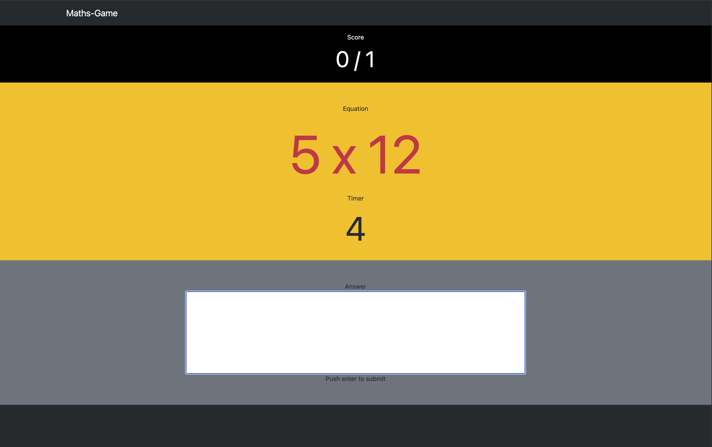

# Maths-Game

A quick-fire multiplication practice game. Answer as many questions as you can in 10 rounds, each with a 5 second timer. Stats at the end highlight which tables tripped you up so you know where to focus.



## How to play

- Open `index.html` in any modern browser (no install needed).
- Type your answer in the input box and press `Enter` to submit; `Escape` clears the box.
- Each round ends when you answer correctly or the 5 second timer runs out.
- After 10 rounds the game shows your score and lists the tables you missed.

## Game details

- Operations: multiplication only (`x`).
- Operand range: 2–12.
- Rounds: 10 per game.
- Timer: 5 seconds per question.
- End-of-game feedback: counts of mistakes per multiplication table.

You can tweak these values in `script.js`:

```js
const ROUNDS_PER_GAME = 10;
const TIME_LIMIT = 5; // seconds per question
const OPERAND_LOWERLIM = 2;
const OPERAND_UPPERLIM = 12;
const OPERATIONS = "x"; // set to "+-x/" to add more operators
```

## Project structure

- `index.html` – layout and Bootstrap includes.
- `style.css` – custom sizing and colors for the timer, score, and input.
- `script.js` – game loop, countdown, scoring, and error tracking.
- `image.png` – example gameplay screenshot.

## Possible enhancements

- Add more operations or difficulty levels.
- Persist scores to localStorage.
- Add sound effects and accessibility tweaks (aria-live updates, larger color contrast).

\*README generated using Codex
